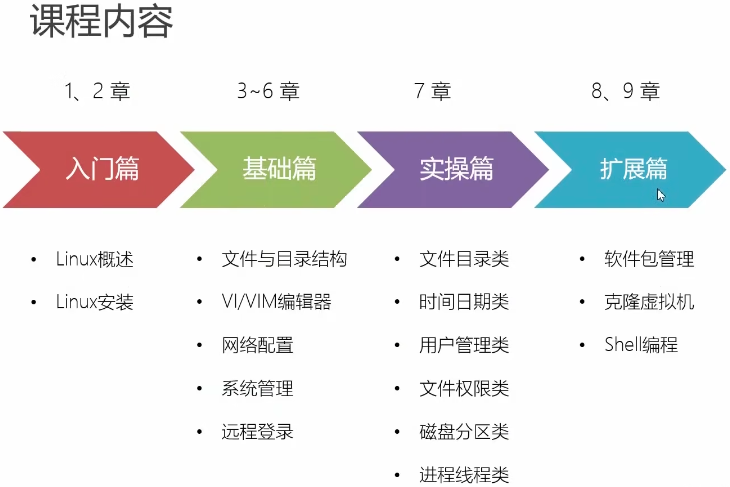
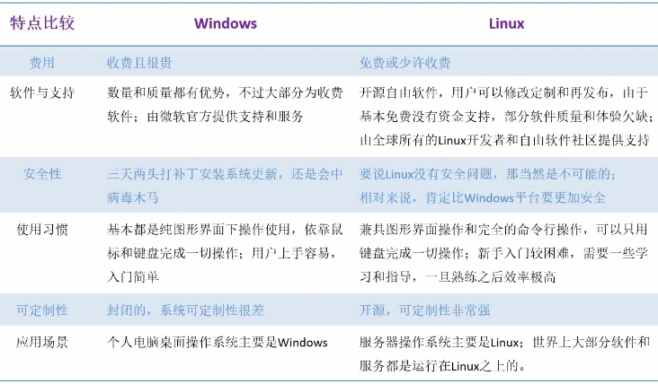
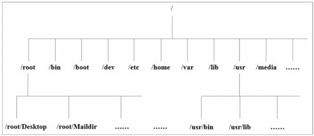

# linux

## 课程介绍

系统：基于CentOS 7

课程来源：b站搜索公众号“尚硅谷”

链接：https://www.bilibili.com/video/BV1WY4y1H7d3?spm_id_from=333.999.0.0&vd_source=271907b5ff31680eaa99ee99b17aaab5

## 第1章 Linux概述

### 1.1 什么是Linux

- 是一个操作系统(三大操作系统：Windows、Linux、macos)
- 基于Unix

### 1.2 Linux发行版

- RedHat
  - RedHat企业版
  - fedora
  - **CentOS**
- debian
  - ubuntu(桌面好看)
    - Mint
- SUSE（最华丽好看的OS，在欧洲使用较多）
  - openSUSE
- ...... 

### 1.3 Linux和Windows

## 第2章 Linux安装与使用

#### 安装

在学习中使用自己的Linux服务器，服务器系统是CentOS。

如果使用Windows或者linux来配置CentOS环境，需要下载虚拟机。步骤如下：

- 下载CentOS：www.centos.org   。centso8目前已经被弃用，所以使用7版本
- 然后下载Vmware：www.vmware.com
- 检查计算机是否启动了虚拟化技术：
  - windows系统查看任务管理器-性能：“虚拟化：已启用”

#### 使用

1）桌面使用

Centos、ubuntu等都有可视化桌面，操作简单易上手。

2）终端使用

命令行操作

## 第3章 Linux文件系统 

### 3.1 Linux文件

Linux系统中一切皆文件（后面再详细讲解）。

### 3.2 Linux目录结构

Linux系统常常显示一棵树的形式，在根目录下，

不同文件夹中分别放置不同类型的数据，以层级的形式存储。

Linux目录是一个虚拟目录，其层级关系是一个逻辑关系，有**挂载点**的概念，物理上的存储分区关系并不体现在层级目录中。 

- / ：Linux根目录

该看第14个视频了

 

